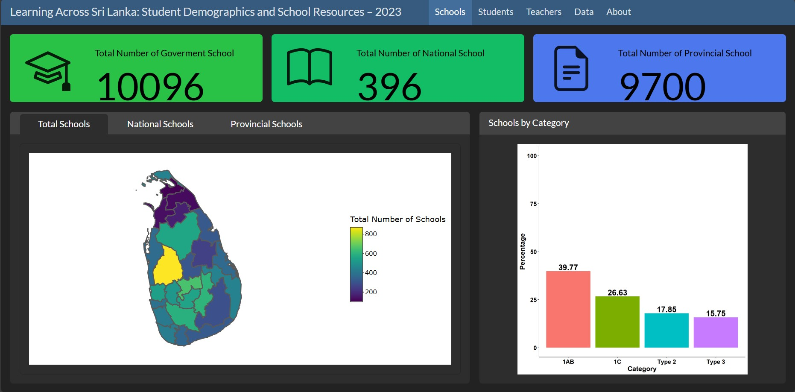
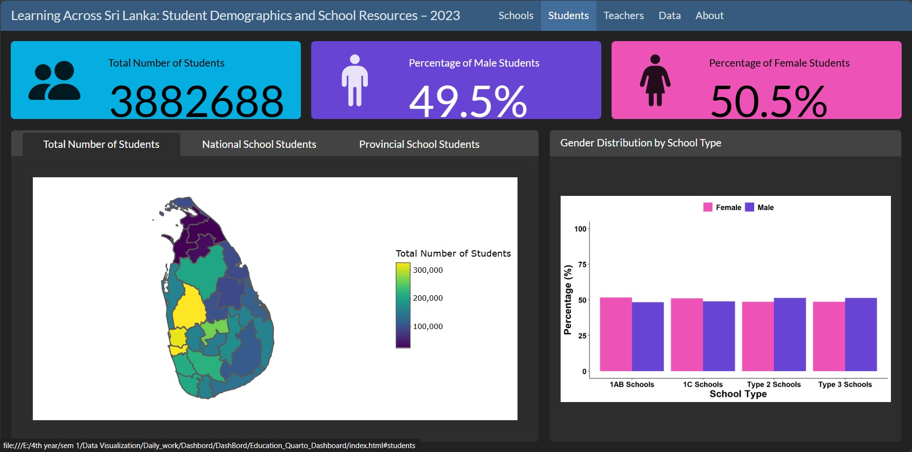
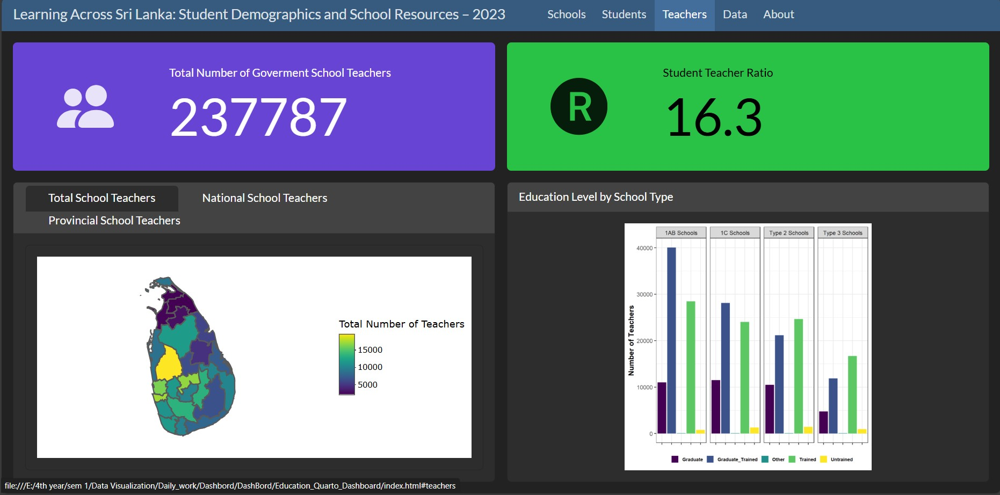

# **Learning Across Sri Lanka: Student Demographics and School Resources (2023)**

 

Education is a crucial sector in a country. Because if students have a good education, it helps to enhance the country's economy. In this sector, three parties need to be considered as a country when providing the resources. They are the Number of Schools, Students, and Teachers. In this dashboard, each party has three separate tabs assigned.

The topic is “**Learning across Sri Lanka**,” which has directly enhanced how the school system is distributed throughout the districts. Interactive maps display the distribution of schools, students, and teachers, while tabbed visualizations allow detailed comparison between national and provincial institutions. Additional charts showcase school categories, gender distribution among students, and teachers’ education levels, enabling an intuitive understanding of patterns and trends. Built with R, ggplot2, plotly, and reactable, the dashboard supports interactive exploration, including filtering and downloading of data tables.

 

You can find the published **Dash Board** at this [**Link**](https://dashboard-quarto.netlify.app/)

 

## **Schools Tab**

 

This dashboard provides a high-level overview of the structure and distribution of the government school system in Sri Lanka as of 2023. It breaks down the total number of schools into key administrative categories, specifically distinguishing between National Schools and Provincial Schools. The data highlights the composition of the school system, showing that the vast majority of institutions are managed at the provincial level. Furthermore, it delves deeper into the categorization of schools by type (1AB, 1C, 2, 3), which is a crucial indicator of the resources, facilities, and academic streams offered by each institution. This visualization is essential for understanding the foundation infrastructure of the Sri Lankan education system and planning for equitable resource allocation.

 

 

## **Student Tab**

 

This panel focuses on the student population within Sri Lanka’s government schools in 2023. It presents the total number of students enrolled, showcasing a nearly equal gender distribution across the system. The data is further segmented by school type (1AB, 1C,Type 2,Type 3), revealing how the student population is distributed across institutions with varying levels of resources and facilities. Understanding this distribution is critical for analyzing issues of access, equity, and capacity within the education system. It helps policymakers identify which school types serve the largest student populations and where targeted investments might be needed most.

 

 

## **Teachers Tab**

 

This section details the human resources powering Sri Lanka’s government schools, specifically the teaching workforce. It presents the total number of teachers and breaks down their distribution between National and Provincial schools. A critical metric featured is the Student-Teacher Ratio of 16.3:1, which is a vital indicator of class size, potential individualized attention, and the overall health of the education system. The dashboard also analyzes the distribution of teachers across different school types (1AB, 1C,Type 2,Type 3), providing insight into whether teaching resources are aligned with student population densities in these various categories.

 

 

